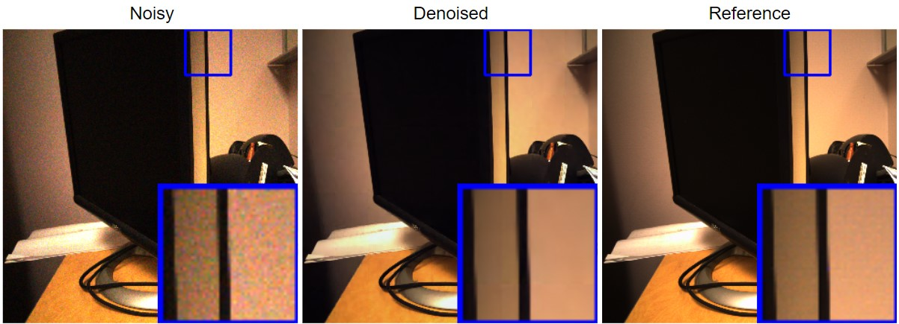
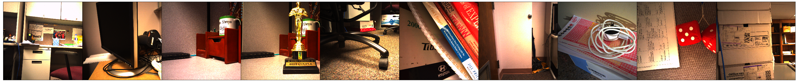

# pytorch-deepglr
A pytorch implementation of Deep Graph Laplacian Regularization for image denoising. Original work: [Zeng et al.](http://openaccess.thecvf.com/content_CVPRW_2019/papers/NTIRE/Zeng_Deep_Graph_Laplacian_Regularization_for_Robust_Denoising_of_Real_Images_CVPRW_2019_paper.pdf)
<p align="center">
  
</p>

# Installation
1. Clone this [repository](https://github.com/huyvd7/pytorch-deepglr)
2. Packages requirements: if you already had the same Pytorch version (pytorch==1.2.0, torchvision==0.4.0), remove 2 first lines in ```requirements.txt```. 

    ```python
    torch==1.2.0
    torchvision==0.4.0
    scipy==1.3.1
    matplotlib==3.1.2
    numpy==1.17.2
    scikit_image==0.16.2
    opencv-python
    ```

3. Install required packages listed in requirements.txt (with Python 3.7)

    ```python
    pip install -r requirements.txt
    ```     
      
4. If you have issues when installing PyTorch. Please follow their official installation guide [PyTorch](https://pytorch.org/get-started/previous-versions/). Please looking for this version ```pytorch==1.2.0 and torchvision==0.4.0```

# Basic usage
## Evaluate a trained model
Two sample scripts to evaluate the trained models are provided. For both DeepGLR and GLR. The GLR is a smaller network and can be tested quickly

### Evaluate DeepGLR

    python validate_DGLR.py dataset/test/ -m model/deepglr.pretrained -w 324 -o ./
    
The above command resizes the input images located at ```dataset/test/``` to square images with size ```324 x 324```, then performs evaluation for the given trained DeepGLR ```model/deepglr.pretrained``` and saves outputs to ```./``` (current directory)


### Evaluate GLR

    python validate_GLR.py dataset/test/ -m model/glr.pretrained -w 324 -o ./
    
The above command runs much faster but it has poorer results because it's using a single GLR layer. It resizes the input images located at ```dataset/test/``` to square images with size ```324 x 324```, then performs evaluation for the given trained GLR ```model/glr.pretrained``` and saves outputs to ```./``` (current directory)

      
### NOTE

<p align="center">
  
</p>

The provided sample dataset in this directory is a resized version of RENOIR dataset (720x720 instead of 3000x3000). The original dataset is located at [Adrian Barbu's site](http://adrianbarburesearch.blogspot.com/p/renoir-dataset.html).

Since this is a resized dataset, **the evaluation results are different from what were reported (MUCH HIGHER!!!)**. For this sample dataset, the results are listed below:

| Metric        | Train           | Test  |
| :-------------: |:-------------:| :-----:|
| SSIM | 0.900 | 0.887 |
| PSNR | 35.69 | 33.28 |

To reproduce the same results as written in the report, please replace the sample dataset in this repository with the original one. For your convinient, you can get the original from this [Google Drive mirror](https://drive.google.com/file/d/1gK611CnIC5PmUDLgCp8jVrEygn6VOytf/view?usp=sharing). This mirror will be deleted at the end of Dec 2019.

## Train a model
### Train a DeepGLR
    
    python train_DGLR.py dataset/train/ -n MODEL_NAME -d ./ -w 324 -e 200 -b 100 -l 2e-4 
    
The above command will train a new DeepGLR with these hyperparameters:

    Dataset: dataset/train/
    Output model name: MODEL_NAME (-n)
    Output directory: ./ (-d)
    Resize the given dataset to: 324x324 (-w)
    Epoch: 200 (-e)
    Batch size: 100 (-b)
    Learning rate: 2e-4 (-l)

**Note:** training a DeepGLR from scratch would require a lot of hyperparameter tuning depends on the dataset and also randomization. It is easier to train 4 separate single GLR first, then stack them manually (this is a future work, feel free to make a pull request!)

We can also continue training an existing DeepGLR by using ```-m PATH_TO_EXIST_MODEL```. Thus, to train from ```model/deepglr.pretrained```, we can use:

    python train_DGLR.py dataset/train/ -m model/deepglr.pretrained -n MODEL_NAME -d ./ -w 324 -e 200 -b 100 -l 2e-4 

### Train a GLR

    python train_GLR.py dataset/train/ -n MODEL_NAME -d ./ -w 324 -e 200 -b 100 -l 2e-4 
    
Same parameters as DeepGLR/


## Remove noise of a single image using a trained DeepGLR

    python denoise.py INPUT_IMAGE -m model/deepglr.pretrained -w 324 -o OUTPUT_IMAGE

The above command will resize the ```INPUT_IMAGE``` to ```324x324```, then denoise it using a trained DeepGLR ```model/deepglr.pretrained``` and save the result at ```OUTPUT_IMAGE```

# Acknowledgments
Most of these works are done on Google Colaboratory. Thanks Google for the free GPUs. 

